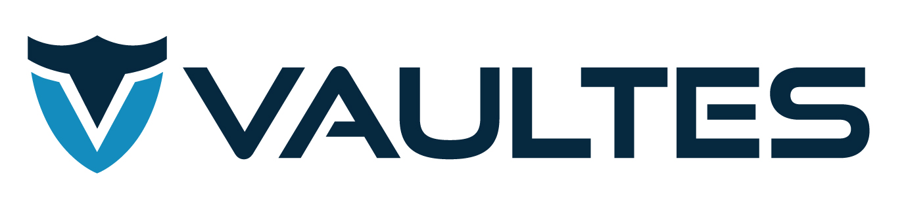

# Overview

Vaultes LLC is proud to submit **V20x** as part of the FedRAMP20x Phase 1 pilot. 

V20x is a newly developed web-based toolset to expedite audit evidence collection and verification.

# Rationale 

Audit evidence gathering is a slow, expensive, and error prone process. Once gathered evidence must be reviewed, and often regathered adding additional time, cost, and overhead to the process. As a FedRAMP and StateRAMP Third-Party Assessment Organization (3PAO) that has conducted over 150 cybersecurity audits and assesssments, Vaultes is deeply familiar with these costs and pain. We developed V20x to provide a faster, more modern approach to evidence gathering and submission.

V20x aimed to solve three main problems:

1. Allows for a secure, organized, upload of documentary evidence allowing an end user to quickly review what documentation was needed, what had been provided, and what had been reviewed and approved or rejected.
1. Allows for attestation of compliance for controls that are not easily documented.
1. Allows for automatic collection, and validation, of evidence where appropriate.

## Technical Approach

Modern cloud providers all offer a marketplace of turn-key services. V20x was designed from the beginning to fit cleanly into this model. A prospective client can instantiate a V20x instance in their environment, gather evidence at their leisure, and only engage with Vaultes for final validation and sign off once all necessary evidence, attestations, and automated checks had been completed.

This significantly reduces the time, cost, and toil, faced by a client seeking an audit for FedRAMP certification or other purposes.

## Security Considerations

We ensure environmental security by offering V20x through the various cloud marketplaces. There's no need for evidence, documentation, or reporting to leave the client's environment. This significantly reduces the risk associated with evidence validation. 

## Guidance and Automation

V20x strives to automate as much of the evidence collection as possible. However, it's not possible to automatically gather everything required for an assessment. For those scenarios v20x aims to provide clear, concise, guidance wherever possible to ensure that the client is able to confidently collect necessary ewvidence, and avoid costly re-work once evidence validation begins.

For evidence that can be gathered automatically, V20x will automatically scan the client's environment, gather the necessary information, and report on the success, or failure, of each automated KSI. After a scan is completed V20x provides a clear, human-readable overview detailing the evidence that was gathered, the validation that was performed, and the outcome of the analysis.

## Versioning

V20x is being actively developed, and undergoing scruitiny by both commercial, and Federal clients. To support the future growth of the toolset Vaultes has adopted a semantic versioning scheme for V20x. This ensures that as the tooling continues to grow, change, and evolve, past assesments will still be viewable, and can be used as a baseline to compare with current and future assesments allowing clients to document improvement over time as they progress from FedRAMP low, to medium, and high classifications. 
